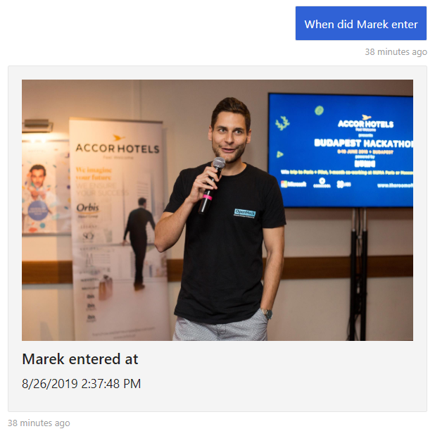

# Vision AI DevKit Intelligent Alarm

Vision AI DevKit Intelligent Alarm is twist or update if you will to already existing [Intelligent Alarm Solution](https://github.com/MarekLani/IoTIntelligentAlarm). What makes it intelligent alarm? For starters, just briefly, this solution is capable to detect persons, recognize entrants, provide information about past entries and raise alert or notification in case of arrival of unknown entrant. 

While first version of Intelligent Alarm was heavily dependent on usage of IoT Sensors, you will find none of those in this new version. As the name of the solution says, it  uses [Vision AI DevKit]() device, capable to run Azure Custom Vision Model and recognize various objects, what allowed for getting rid off sensors used in previous version and enabled much wider set of scenarios as whole person detection logic happens only using video stream analysis.

Note that this is a non production pet project, that helped me explore various Azure Services. Nevertheless I believe you might find some pieces of it interesting and usable in your own project, or you might just replicate the solution and this way get yourself familiar with various Azure Services and Vision AI DevKit as well. If you are interested in more details, keep on reading, we will walk thru the key parts of the solution.  Familiarity with basic concepts behind Azure Services used within this project is recommended. At the end of the article I provide documentation links for services used within this solution, which you may use to ramp up.

In this text I will discuss how I used Vision Dev Kit to capture and upload images to Azure in case person is detected. Further you will find details on how Azure function processes captured image, invokes Face API and notifies user about the new entry, while in the last part I will mention details about presentation layer of this solution built as chat bot using Bot Framework. Notice: Expect Node.js on Vision AI Dev Kit side and C# everywhere else. 

## Solution Architecture

Probably the quickest way how to give you overview of all the services used within this solution is to share the architecture diagram, so here it is:


## How it works?

As stated this solution provides capability to identify people in monitored area and is also capable to surface collected information. It is aiming on scenarios, when you want to know who and when entered the area. This makes it perfect base for example for automated card/chip less attendance systems with alerting capabilities or even as the name says for alarm solution.

There are two important parts to the solution. First is intelligent device - Vision AI DevKit deployed "on the edge". This camera is capable of hardware acceleration of AI models and it runs Azure IoT Edge. It is capable of detecting persons, capturing photos and uploading them to Azure for further processing (face identification). It would be efficient to do the face identification on the edge as well, unfortunately, at this point Face API can't be exported to docker container compatible with ARM processor architecture, which is used by Vision AI DevKit.

Second part to the solution is basically solution backend and presentation layer responsible for image/data processing, storing and surfacing.

 Now let's walk thru the solution details, from video stream processing to entries data presentation layer.

### Entrants photos capturing

Photo capture happens of course on the edge - on the Vision AI Dev Kit Camera. In order to make solution efficient, it was needed to find a way how to run face identification in the cloud only for pictures containing persons. To achieve that, there are three modules deployed to DevKit, namely *[AI Vision Dev Kit Get Started Module](https://github.com/microsoft/vision-ai-developer-kit/tree/master/samples/official/ai-vision-devkit-get-started/modules/AIVisionDevKitGetStartedModule)* with default custom vision model, *Azure Stream analytics module* -  and *Capture module*. The whole capture process works the following way:

1. *AI Vision Dev Kit Get Started Module* continuously processes captured video and detects objects in the captured video stream. In case object is detected it sends telemetry message into edge hub. Every message originating from this module is routed to stream analytics module.

2.  Azure Stream Analytics module named *ASAEdgeFilter* reads the messages and filters out every message which does not contain label with value *Person*. Moreover, it picks up only first message in every 30 second window. This is simple logic to achieve to not to capture multiple pictures of the same entrant, but in case of production scenario it should be changed, to comply with specifics of the scenario. Messages selected by ASA Edge Filter module are directed to *Capture Module*. ASA Job is defined as follows:

   ```sql
   SELECT
       label, confidence, System.TimeStamp as timestamp
   INTO
       Output
   FROM
       Input
   WHERE
     ( IsFirst(second, 30) OVER (When label = 'person' AND confidence >= 60) = 1)
   ```

   You can find the whole *ASAEdgeFilter* project in the *VisionDevKitModules* folder of this repository.

3. *Capture module* is initialized by any incoming message to it's input. It connects to mpeg stream provided by AI Vision Dev Kit Get Started Module and using ffmpeg library it creates photo captures and uploads them to Azure Storage container. You can find detailed documentation and Capture module code in this repository: https://github.com/MarekLani/VisionDevKit_CaptureModule

You can find generalized IoT Edge deployment template in *VisionDevKitModules* folder of this repository. Note that you will need to build and push capture module docker image to your own container repository and publish *ASAEdgeFilter* job to your Azure subscription and reference them in your deployment template. You can run also [Web Stream module](https://github.com/microsoft/vision-ai-developer-kit/tree/master/samples/official/ai-vision-devkit-get-started/modules/WebStreamModule), which enables you to view almost real time video output from  *AI Vision Dev Kit Get Started Module*. 

### Processing captures, identifying faces and raising alerts and notifications

Captured photos are being picked up by *Capture Processor* - C# Azure Function, which gets triggered by every new file uploaded to storage container. First Capture Processor runs face detection and identification thru Face API calls.  Subsequently it stores results to Cosmos DB and invokes proactive message thru chat bot and sends SMS using Twilio service in case entrant wasn't recognized. Note that for Face API Person Group creation and training I have used [Intelligent Kiosk application](https://github.com/microsoft/Cognitive-Samples-IntelligentKiosk), so you won't find code providing this functionality in this repo. 

Capture Processor function code is stated bellow. Notice, how simple it was to implement write operation towards Cosmos DB and also send SMS message, thanks to functions bindings.  For full implementation see *VisionAlarmBackend* project within this repository. 

```C#
[FunctionName("ProcessCapture")]
public async Task Run([BlobTrigger("vision/{name}", Connection = "StorageConnectionString")]Stream myBlob, string name,
    [CosmosDB(
        databaseName: "%CosmosDB%",
        collectionName: "%CosmosCollection%",
        ConnectionStringSetting = "CosmosDBConnection")]IAsyncCollector<Entry> document, 
    [TwilioSms(
        AccountSidSetting = "TwilioAccountSid",
        AuthTokenSetting = "TwilioAuthToken", 
        From = "%FromNumber%")] IAsyncCollector<CreateMessageOptions> smsOptions,
    ILogger log)
{
                        
    //We need to obtain linux timestamp from image name
    //(8 chars "capture_" prefix, 12 = prefix + ."jpg" suffix)
    var timeStampString = name.Substring(8, name.Length - 12);
    var dto = DateTimeOffset.FromUnixTimeMilliseconds(Convert.ToInt64(timeStampString));
    var timestamp = dto.DateTime;

    List<string> entrants = new List<string>();

    try
    {
        //Make sure you specify Recognition Model, which was used when creating person in person group
        var detectedFaces = await _faceClient.Face.DetectWithStreamAsync(myBlob, recognitionModel: RecognitionModel.Recognition02);
        var group = (await _faceClient.PersonGroup.ListAsync())
            .Where(g => g.Name == Environment.GetEnvironmentVariable("PersonGroupName")).FirstOrDefault();

        var dfIds = detectedFaces.Select(f => f.FaceId.ToGuid()).ToList();

        if (dfIds.Count != 0 && group != null)
        {
            var identifiedFaces = await _faceClient.Face.IdentifyAsync(dfIds, group.PersonGroupId);
            log.LogInformation(identifiedFaces.Count().ToString());

            if (identifiedFaces.Count > 0)
            {
                foreach (var f in identifiedFaces)
                {
                    if (f.Candidates.Count > 0 && f.Candidates.First().Confidence > 0.7)
                    {
                        var pInfo = await _faceClient.PersonGroupPerson.GetAsync(group.PersonGroupId, f.Candidates.First().PersonId);
                        //We put it to lower, as LUIS entities are always returned in "ToLower" form
                        entrants.Add(pInfo.Name.ToLower());
                    }
                }
            }
        }

        var entry = new Entry(Guid.NewGuid().ToString(), timestamp, entrants, name.ToLower());
        await document.AddAsync(entry);

        if (!entrants.Any()) {
            //If no known entrant identified, we send sms notification
            await smsOptions.AddAsync(new CreateMessageOptions(Environment.GetEnvironmentVariable("ToNumber"))
            {
                Body = "Warning, unidentified entrant!"
            });
        }

        //Invoking Bot Proactive message by sending request to notify endpoint 
        var content = new StringContent($"{{\"imageName\":\"{name}\",\"text\":\"{String.Join(", ", entrants.ToArray())}\"}}", Encoding.UTF8, "application/json");
        await _httpClient.PostAsync(Environment.GetEnvironmentVariable("ProactiveBotEndpoint"),content);
               
    }
    catch (Exception e)
    {
        log.LogInformation(e.Message);
    }
            
    log.LogInformation("Succesfully processed blob: "+name);
}
```

### Surfacing entries data

Entries data stored in Azure Storage (photo capture) and Cosmos DB (metadata) are surfaced to user thru messaging user interface provided by Chat Bot application. Chat Bot application is not accessing the data directly, but rather thru data access layer - API implemented using HTTP Triggered C# Azure Functions. 

**REST API**

These functions implement logic to query database and return data based on four base intents, that user may invoke thru chat bot (last entry, last entry for specific person, last known entrant and names of entrants on specific day). You can find code for this functions bellow, while it is also part of *VisionAlarmBackend* project. Again, notice Azure Functions Cosmos DB input binding, which significantly simplifies querying the database.

```c#
 [FunctionName("LastEntry")]
public IActionResult Run(
    [HttpTrigger(AuthorizationLevel.Function, "get", Route = "LastEntry")] HttpRequest req,
    [CosmosDB("%CosmosDB%", "%CosmosCollection%",
        ConnectionStringSetting = "CosmosDBConnection",
        SqlQuery = "SELECT TOP 1 *  FROM c ORDER BY c.Timestamp DESC")]
        IEnumerable<Entry> entries,
    ILogger log)
{
    log.LogInformation("C# HTTP trigger function processed a GetLastEntry request.");

    return (entries.Count() > 0)
        ? (ActionResult)new OkObjectResult(entries.First())
        : new BadRequestObjectResult("Couldn't get last entry");
}

[FunctionName("GetLastEntryForName")]
public IActionResult GetLastEntryForName(
    [HttpTrigger(AuthorizationLevel.Function, "get", Route = "GetLastEntryForName/{name}")] HttpRequest req,
    [CosmosDB("%CosmosDB%", "%CosmosCollection%",
        ConnectionStringSetting = "CosmosDBConnection",
        SqlQuery = "SELECT VALUE c FROM c JOIN e in c.Entrants WHERE CONTAINS(e, {name}) ORDER BY c.Timestamp DESC")]
        IEnumerable<Entry> entries,
    ILogger log)
{
    log.LogInformation("C# HTTP trigger function processed a GetLastEntryForName request.");

    return (entries.Count() > 0)
        ? (ActionResult)new OkObjectResult(entries.First())
        : new BadRequestObjectResult("Couldn't get entries for provided name. Please pass existing name in url");
}

[FunctionName("LastKnownEntrant")]
public IActionResult LastKnownEntrant(
    [HttpTrigger(AuthorizationLevel.Function, "get", Route = "LastKnownEntrant")] HttpRequest req,
    [CosmosDB("%CosmosDB%", "%CosmosCollection%",
        ConnectionStringSetting = "CosmosDBConnection",
        SqlQuery = "SELECT TOP 1 *  FROM c WHERE c.Entrants != '' ORDER BY c.Timestamp DESC")]
        IEnumerable<Entry> entries,
    ILogger log)
{
    log.LogInformation("C# HTTP trigger function processed a LastKnownEntrant request.");

    return (entries.Count() > 0)
        ? (ActionResult)new OkObjectResult(entries.First())
        : new BadRequestObjectResult("Couldn't get Last Known Entrant");
}

[FunctionName("EntrantsOnDay")]
public IActionResult EntrantsOnDay(
[HttpTrigger(AuthorizationLevel.Function, "get", Route = "EntrantsOnDay/{date}")] HttpRequest req,
    [CosmosDB("%CosmosDB%", "%CosmosCollection%",
        ConnectionStringSetting = "CosmosDBConnection",
        SqlQuery = "SELECT *  FROM c WHERE c.Entrants != '' AND c.Timestamp > {date}")]
        IEnumerable<Entry> entries,
ILogger log)
{
    log.LogInformation("C# HTTP trigger function processed a EntrantsOnDay request.");

    List<string> entrants = new List<string>();
    foreach (var e in entries)
    {
        foreach (var n in e.Entrants)
        {
            if (n != "" && !entrants.Contains(n))
                entrants.Add(n);
        }
    }

    return (ActionResult)new OkObjectResult(entrants);  
}
```

**Chat Bot**

Chat bot application is built using *Bot Framework*. Thanks to integration with *Language Understanding Intelligent Service* it is capable to process natural language inputs. For example you can ask Show me last entry. When did Marek (or somebody else trained within your Face API model) enter? Who did enter today? Who was the last identified entrant? 

In order to make this work, you should train your own LUIS model and configure the chat bot application to use it. You can find exported LUIS model in VisionAlarmBot -> LUIS folder. Note, that the model was not trained extensively, and in some cases it might not identify the intent precisely. 

As said chat bot application itself was developed using Bot Framework specifically C#  v4 version. I chose chat bot as it was quite simple way how to create effective user interface with support of notifications. There are two important pieces to the chat bot code. 

First is code enabling ***proactive messages***, while this functionality is being invoked from Capture Processor function. So this invocation is possible, there was need to register new endpoint within the bot. It was done in standalone API controller:

```C#
 [Route("api/notify")]
 [ApiController]
 public class NotifyController : ControllerBase
 {
 ...
 
 public async Task<IActionResult> Post([FromBody] ProactiveMessage message)
    {

        await ((BotAdapter)_adapter).ContinueConversationAsync(_appId, _conversationReferences.Values.Last(), CreateCallback(message), default(CancellationToken));
        // Let the caller know proactive messages have been sent
        return new OkResult();

    }

    private BotCallbackHandler CreateCallback(ProactiveMessage message)
    {
        return async (turnContext, token) =>
        {
            try
            {
                var cardImages = new List<CardImage>();
                cardImages.Add(new CardImage(url: _configuration["StorageAccountUrl"] + message.ImageName));

                var heroCard = new HeroCard
                {
                    Title = "New Entry!!",
                    Subtitle = message.Text,
                    Images = cardImages,
                };

                var reply = MessageFactory.Attachment(heroCard.ToAttachment());
                await turnContext.SendActivityAsync(reply);
                // Send the user a proactive confirmation message.
            }
            catch (Exception e)
            {
                //TODO handle error logging
                throw e;
            }
        };
    }
 }
```

Before post request to 'api/notify' uri can fire up proactive message, we need to store conversation reference, which is used to route the proactive message to correct chat window. In this solution it is being stored just in memory and as we do not count with more users, we only store last conversation reference obtained during conversation update event. In case you are creating production solution you should change this logic, store per user conversation reference and use external durable data store (e.g. Cosmos DB). Bellow you can see code for storing the conversation reference:

```c#
public class VisionAlarmBot : ActivityHandler
{
	//Fed from DI container
    private readonly ConcurrentDictionary<string, ConversationReference> _conversationReferences;
	...
	private void AddConversationReference(Activity activity)
    {
        var conversationReference = activity.GetConversationReference();
        _conversationReferences.AddOrUpdate(conversationReference.User.Id, conversationReference, (key, newValue) => conversationReference);
    }
	
	protected override Task OnConversationUpdateActivityAsync(ITurnContext<IConversationUpdateActivity> turnContext, CancellationToken cancellationToken)
    {
        AddConversationReference(turnContext.Activity as Activity);
        return base.OnConversationUpdateActivityAsync(turnContext, cancellationToken);
    }
    ...
    
}
```

Main piece of the chat bot logic, is part which ***recognizes intents from input text from user, invokes REST API and displays entry details*** using Hero Card. You can find this logic bellow:

```c#
public class VisionAlarmBot : ActivityHandler
{
  ...  

    protected override async Task OnMessageActivityAsync(ITurnContext<IMessageActivity> turnContext, CancellationToken cancellationToken)
    {
        // First we call LUIS to recognize Intent
        var recognizerResult = await _botServices.LuisRecognizer.RecognizeAsync(turnContext, cancellationToken);

        await ProcessAlarmAsync(turnContext, recognizerResult, cancellationToken);
    }

    private async Task ProcessAlarmAsync(ITurnContext<IMessageActivity> turnContext, RecognizerResult result, CancellationToken cancellationToken)
    {
        _logger.LogInformation("ProcessLAlarmAsync");
        var client = _clientFactory.CreateClient("visionBackend");
        var topIntent = result.GetTopScoringIntent().intent;
        TextInfo textInfo = new CultureInfo("en-US", false).TextInfo;

        switch (topIntent)
        {
            case "LastEntry":
                var entry = JsonConvert.DeserializeObject<Entry>(await client.GetStringAsync("LastEntry"));
                await DisplayEntry(turnContext, entry.ImageName, "Last Entry", "Last entrants were: " + textInfo.ToTitleCase(String.Join(", ", entry.Entrants.ToArray())), entry.Timestamp, cancellationToken);
                break;
            case "LastIdentifiedPersonEntered":
                var entry2 = JsonConvert.DeserializeObject<Entry>(await client.GetStringAsync("LastKnownEntrant"));
                await DisplayEntry(turnContext, entry2.ImageName, "Last know entrant(s)", "Last known entrants were: " + textInfo.ToTitleCase(String.Join(", ", entry2.Entrants.ToArray())), entry2.Timestamp, cancellationToken);
                break;
            case "PersonArrived":
                var name = result.Entities["Person"][0].ToString();
                var entry3 = JsonConvert.DeserializeObject<Entry>(await client.GetStringAsync("GetLastEntryForName/" + name));
                await DisplayEntry(turnContext, entry3.ImageName, textInfo.ToTitleCase(name) + " entered at", " ", entry3.Timestamp, cancellationToken);
                break;
            case "ShowMeTodaysEntrants":
                var todaysEntrants = JsonConvert.DeserializeObject<string[]>(await client.GetStringAsync("EntrantsOnDay/" + DateTime.Now.Date.ToString("s")));
                string namesList = "";
                foreach (var n in todaysEntrants)
                {
                    namesList += " " + n;
                }
                await turnContext.SendActivityAsync("People who entered today:" + textInfo.ToTitleCase(namesList));
                break;
            default:
                await turnContext.SendActivityAsync("Sorry your intent was not recognized");
                break;
        }
    }

	///Display entry using Hero Card
    private async Task DisplayEntry(ITurnContext<IMessageActivity> turnContext, string imageName, string title, string text, DateTime timestamp, CancellationToken cancellationToken)
    {
        var cardImages = new List<CardImage>();
        cardImages.Add(new CardImage(url: _configuration["StorageAccountUrl"] + imageName));

        var heroCard = new HeroCard
        {
            Title = title,
            Subtitle = timestamp.ToString(),
            Text = text,
            Images = cardImages,
        };

        var reply = MessageFactory.Attachment(heroCard.ToAttachment());
        await turnContext.SendActivityAsync(reply, cancellationToken);
    }
}
```

You can test chat bot using emulator or publish it using Azure Bot Service and make it available on various messaging channels. The whole chat bot code can be found in *VisionAlarmBot* project.  Below is example of conversation wit the bot (with test picture).



## Summary

In this readme I lead you thru the most important code of Intelligent Alarm solution built on top of several Azure Cloud Services and Vision Dev Kit device. We looked at how it is possible to use Vision Dev Kit device to capture photos of persons, how we can utilize Azure Functions to do further image processing, invoke notification and easily create data access layer on top of Cosmos DB and as a last point, we visited Chat Bot code enabling users to browse in entries data history. I hope you found some of these pieces interesting and reusable in your project. Thanks for reading. 

Bellow you can find link to documentation for services used in this project.

## Useful links

**Vision Dev Kit Quick Start:** https://azure.github.io/Vision-AI-DevKit-Pages/docs/quick_start/

**Azure IoT Edge - deploy code to Linux device:** https://docs.microsoft.com/en-us/azure/iot-edge/quickstart-linux

**What is Azure Custom Vision**: https://docs.microsoft.com/en-us/azure/cognitive-services/custom-vision-service/home

**Azure Blob Storage:** https://docs.microsoft.com/en-us/azure/storage/blobs/storage-blobs-overview

**About Azure Functions:** https://docs.microsoft.com/en-us/azure/azure-functions/functions-overview

**Azure Functions Trigger and Bindings:** https://docs.microsoft.com/en-us/azure/azure-functions/functions-triggers-bindings

**Dependency Injection with Azure Functions:** https://docs.microsoft.com/en-us/azure/azure-functions/functions-dotnet-dependency-injection

**What is Face API:** https://docs.microsoft.com/en-us/azure/cognitive-services/face/overview

**What is LUIS (Language Understanding Intelligent Service):** https://docs.microsoft.com/en-us/azure/cognitive-services/luis/what-is-luis

**Azure Bot Service and Bot Framework:** https://docs.microsoft.com/en-us/azure/bot-service/?view=azure-bot-service-4.0

**Proactive messaging in Bot Framework:** https://docs.microsoft.com/en-us/azure/bot-service/bot-builder-howto-proactive-message?view=azure-bot-service-4.0&tabs=csharp


