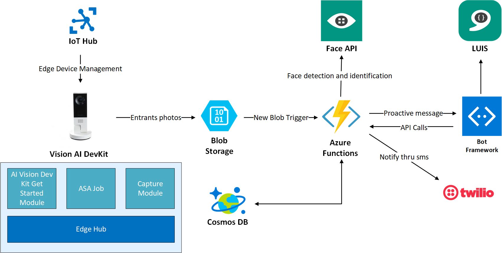

# Vision Dev Kit Intelligent Alarm

Vision Dev Kit Intelligent Alarm is twist to already existing Intelligent Alarm Solution. What makes it intelligent alarm? For starters, just briefly, this alarm solution is capable to detect faces, recognize entrants, provide information about past entries and raise alert or notification in case of arrival of unknown entrant. You will find more technical details further in the text.

While first version of Intelligent Alarm was heavily dependent on usage of IoT Sensors, you will find none of those in this new version of Intelligent Alarm. As the name of the project says, it uses Vision Dev Kit device, capable to run Custom Vision Model and recognize various objects, what enabled me to get rid of sensors used in previous version and allowed for new usage scenarios.

Note that this is only non production pet project, that helped me explore various Azure Services. Nevertheless I believe you might find some pieces to it interesting and usable in your own project, or you might just replicate the solution and this way get yourself familiar with various Azure Services and Vision Dev Kit as well. If you are interested to learn more, keep on reading, we will walk thru the most interesting parts of the solution.  Familiarity with basic concepts behind Azure Services used within this project is recommended. At the end of this article I provide documentation links for services used within this solution.


## Solution Architecture

Probably the quickest way how to give you overview of services used within this solution is to share the architecture diagram, so here it is:




## How it works?

As stated this solution provides capability to identify people in monitored area and is also capable to surface collected information. It makes it usable in scenarios, when you want to know who and when entered the area. This makes it perfect base for example for automated card/chip less attendance systems with capability to alert in case of unidentified entrant.

There are two important parts to the solution. First is intelligent device deployed "on the edge". As mentioned this device is Vision Dev Kit camera. This camera is capable of hardware acceleration of AI models and it runs Azure IoT Edge. It captures photos and uploads them to Azure for further processing (Face identification). It would be efficient to do the face detection on the edge as well, unfortunately at this point Face API can't be exported to docker container compatible with ARM processor architecture, which is used within Vision Dev Kit.

Second part to the solution is basically solution backend responsible for image/data processing, storing and surfacing, while there have been technologies such as Azure Functions, Cosmos DB, Bot Framework..

 Now let's visit end to end scenario split into three main steps:

### Entrants photos capturing

Photo capture happens of course on the edge - on the Vision Dev Kit Camera. In order to make solution efficient, it was needed to find a way how to run face identification in the cloud only for pictures containing persons. To achieve that, there are three modules deployed to Vision Dev Kit, namely AI Vision Dev Kit Get Started Module with default custom vision model, Azure Stream analytics module -  and Capture module. The whole capture process works in the following way:

1. AI Vision Dev Kit Get Started Module continuously processes captured video and detects objects in the captured video stream. In case object is detected it sends telemetry message into edge hub. This message is directed to stream analytics module.

2.  Azure Stream Analytics module named *ASAEdgeFilter* reads the messages and filters out every message which does not contain label with value *Person*. Moreover, it picks up only first message in every 30 second window. This is simple logic to achieve to not to capture multiple pictures of the same entrant, but in case of production scenario it should be changed, to comply with specifics of the scenario. Messages selected by ASA Edge Filter module are directed to Capture Module. ASA Job is defined as follows:

   ```sql
   SELECT
       label, confidence, System.TimeStamp as timestamp
   INTO
       Output
   FROM
       Input
   WHERE
     ( IsFirst(second, 30) OVER (When label = 'person' AND confidence >= 60) = 1)
   ```

   You can find the whole *ASAEdgeFilter* project in the *VisionDevKitModules* folder of this repository.

3. Capture module is initialized by any incoming message to it's input. It connects to mpeg the stream provided by AI Vision Dev Kit Get Started Module and using ffmpeg library it creates captures and uploads them to Azure Storage container. You can find detailed documentation and Capture module code in this repository: https://github.com/MarekLani/VisionDevKit_CaptureModule

You can find generalized IoT Edge deployment template in *VisionDevKitModules* folder of this repository. Note that you will need to build and push capture module docker image to your own container repository and publish *ASAEdgeFilter* job to your Azure subscription and reference them in your deployment template.  

### Processing captures, identifying faces and raising alerts and notifications

Captured photos are being picked up by *Capture Processor* - C# Azure Function, which gets triggered by every new file uploaded to storage container. First Capture Processor runs face detection and identification thru Face API calls. Subsequently it stores results to Cosmos DB and invokes proactive message thru chat bot and sends SMS using Twilio service in case entrant wasn't recognized. Capture Processor function code is stated bellow. Notice, how simple it was to implement write operation towards Cosmos DB and also send SMS message, thanks to functions bindings.  For full implementation navigate see *VisionAlarmBackend* project within this repository. 

```C#
[FunctionName("ProcessCapture")]
        public async Task Run([BlobTrigger("vision/{name}", Connection = "StorageConnectionString")]Stream myBlob, string name,
            [CosmosDB(
                databaseName: "%CosmosDB%",
                collectionName: "%CosmosCollection%",
                ConnectionStringSetting = "CosmosDBConnection")]IAsyncCollector<Entry> document, 
            [TwilioSms(
                AccountSidSetting = "TwilioAccountSid",
                AuthTokenSetting = "TwilioAuthToken", 
                From = "%FromNumber%")] IAsyncCollector<CreateMessageOptions> smsOptions,
            ILogger log)
        {
                        
            //We need to obtain linux timestam from image name
            //(8 chars "capture_" prefix, 12 = prefix + ."jpg" suffix)
            var timeStampString = name.Substring(8, name.Length - 12);
            var dto = DateTimeOffset.FromUnixTimeMilliseconds(Convert.ToInt64(timeStampString));
            var timestamp = dto.DateTime;

            string entrants = "";

            try
            {
                //Make sure you specify Recognition Model, which was used when creating person in person group
                var detectedFaces = await _faceClient.Face.DetectWithStreamAsync(myBlob, recognitionModel: RecognitionModel.Recognition02);
                var group = (await _faceClient.PersonGroup.ListAsync())
                    .Where(g => g.Name == Environment.GetEnvironmentVariable("PersonGroupName")).FirstOrDefault();

                var dfIds = detectedFaces.Select(f => f.FaceId.ToGuid()).ToList();

                if (dfIds.Count != 0 && group != null)
                {
                    var identifiedFaces = await _faceClient.Face.IdentifyAsync(dfIds, group.PersonGroupId);
                    log.LogInformation(identifiedFaces.Count().ToString());

                    if (identifiedFaces.Count > 0)
                    {
                        foreach (var f in identifiedFaces)
                        {
                            if (f.Candidates.Count > 0 && f.Candidates.First().Confidence > 0.7)
                            {
                                var pInfo = await _faceClient.PersonGroupPerson.GetAsync(group.PersonGroupId, f.Candidates.First().PersonId);
                                //We enclose name, so we can later filter based on the name
                                entrants += "|" + pInfo.Name + "|";
                            }
                        }
                    }
                }

                var entry = new Entry(Guid.NewGuid().ToString(), timestamp, entrants, name.ToLower());
                await document.AddAsync(entry);

                if (entrants == "") {
                    //If no known entrant identified, we send sms notification
                    await smsOptions.AddAsync(new CreateMessageOptions(Environment.GetEnvironmentVariable("ToNumber"))
                    {
                        Body = "Warning, unidentified entrant!"
                    });
                }

                //Invoking Bot Proactive message by sending request to proactive endpoint 
                var content = new StringContent($"{{\"imageName\":\"{name}\",\"text\":\"{entrants}\"}}", Encoding.UTF8, "application/json");
                await _httpClient.PostAsync(Environment.GetEnvironmentVariable("ProactiveBotEndpoint"),content);

               
            }
            catch (Exception e)
            {
                log.LogInformation(e.Message);
            }
            
            log.LogInformation("Succesfully processed blob: "+name);
        }
```


### Surfacing entries data

Entries data stored in Azure Storage (photo capture) and Cosmos DB (metadata) are surfaced to user thru messaging user interface provided by Chat Bot application. Chat Bot application is not accessing data directly, but rather thru data access layer - API implemented using HTTP Triggered C# Azure Functions. 

These functions implement logic to query database and return data based on 4 base intents, that user may invoke thru chat bot (last entry, last entry for specific person, last known entrant and names of entrants for specific day). You can find code for this functions bellow, while it is also part of VisionAlarmBackend project. Again notice Azure Functions Cosmos DB input binding, which significantly simplifies querying of the database.

```c#
 [FunctionName("LastEntry")]
        public IActionResult Run(
           [HttpTrigger(AuthorizationLevel.Function, "get", Route = "LastEntry")] HttpRequest req,
            [CosmosDB("%CosmosDB%", "%CosmosCollection%",
                ConnectionStringSetting = "CosmosDBConnection",
                SqlQuery = "SELECT TOP 1 *  FROM c ORDER BY c.Timestamp DESC")]
                IEnumerable<Entry> entries,
           ILogger log)
        {
            log.LogInformation("C# HTTP trigger function processed a GetLastEntry request.");

            return (entries.Count() > 0)
                ? (ActionResult)new OkObjectResult(entries.First())
                : new BadRequestObjectResult("Couldn't get last entry");
        }

        [FunctionName("GetLastEntryForName")]
        public IActionResult GetLastEntryForName(
           [HttpTrigger(AuthorizationLevel.Function, "get", Route = "GetLastEntryForName/{name}")] HttpRequest req,
            [CosmosDB("%CosmosDB%", "%CosmosCollection%",
                ConnectionStringSetting = "CosmosDBConnection",
                SqlQuery = "SELECT TOP 1 *  FROM c WHERE CONTAINS(c.Entrants, {name}) ORDER BY c.Timestamp DESC")]
                IEnumerable<Entry> entries,
           ILogger log)
        {
            log.LogInformation("C# HTTP trigger function processed a GetLastEntryForName request.");

            return (entries.Count() > 0)
                ? (ActionResult)new OkObjectResult(entries.First())
                : new BadRequestObjectResult("Couldn't get entries for provided name. Please pass existing name in url");
        }

        [FunctionName("LastKnownEntrant")]
        public IActionResult LastKnownEntrant(
         [HttpTrigger(AuthorizationLevel.Function, "get", Route = "LastKnownEntrant")] HttpRequest req,
          [CosmosDB("%CosmosDB%", "%CosmosCollection%",
                ConnectionStringSetting = "CosmosDBConnection",
                SqlQuery = "SELECT TOP 1 *  FROM c WHERE c.Entrants != '' ORDER BY c.Timestamp DESC")]
                IEnumerable<Entry> entries,
         ILogger log)
        {
            log.LogInformation("C# HTTP trigger function processed a LastKnownEntrant request.");

            return (entries.Count() > 0)
                ? (ActionResult)new OkObjectResult(entries.First())
                : new BadRequestObjectResult("Couldn't get Last Known Entrant");
        }

        [FunctionName("EntrantsOnDay")]
        public IActionResult EntrantsOnDay(
        [HttpTrigger(AuthorizationLevel.Function, "get", Route = "EntrantsOnDay/{date}")] HttpRequest req,
         [CosmosDB("%CosmosDB%", "%CosmosCollection%",
                ConnectionStringSetting = "CosmosDBConnection",
                SqlQuery = "SELECT *  FROM c WHERE c.Entrants != '' AND c.Timestamp > {date}")]
                IEnumerable<Entry> entries,
        ILogger log)
        {
            log.LogInformation("C# HTTP trigger function processed a EntrantsOnDay request.");


            List<string> entrants = new List<string>();
            foreach (var e in entries)
            {
                var names = e.Entrants.Split('|');
                foreach (var n in names)
                {
                    if (n != "" && !entrants.Contains(n))
                        entrants.Add(n);
                }
            }
            return (ActionResult)new OkObjectResult(entrants);  
        }
```


Chat Bot

Get rid of dispatcher, LUIS model explain, explain proactive, 